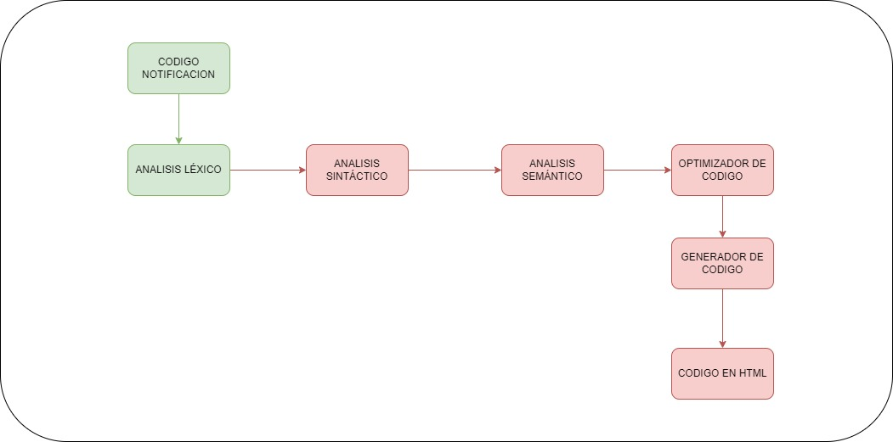
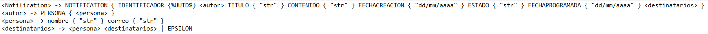
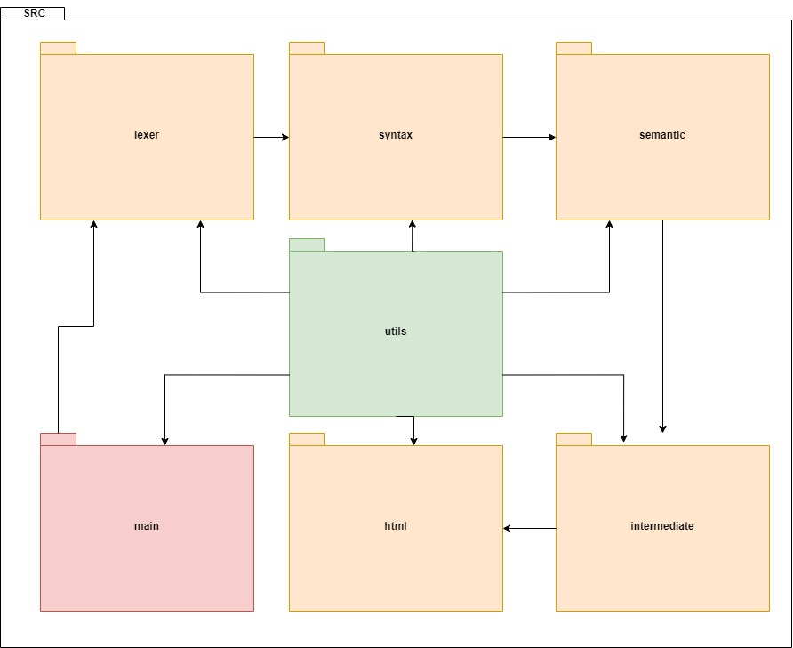

# Proyecto de Compilador en Java

Este proyecto es un compilador en Java que traduce código fuente de un lenguaje específico a HTML. A continuación se describe la estructura del proyecto y su contenido.

# Gramática base

## Estructura del Proyecto

La estructura de carpetas en la raíz del proyecto es la siguiente:

### /lexer

Esta carpeta contiene los componentes relacionados con el análisis léxico:

- **`Lexer.java`**: Implementa el análisis léxico que convierte el texto de entrada en una secuencia de tokens.
- **`Token.java`**: Define la estructura de un token, que incluye el tipo de token y su valor.
- **`TokenType.java`**: Enumera todos los tipos de tokens que el lexer puede identificar.

### /Syntax

Esta carpeta contiene los componentes relacionados con el análisis Sintáctico:

- **`Parser.java`**: Clase donde se implementa el analisis sintáctico, asi como la creacion del arbol recursivo.
- **`ASTNode.java`**: Define la estructura del arbol sintáctico recursivo.

Arbol sintáctico de gramática base

### /Semantic

Esta carpeta contiene los componentes relacionados con el análisis Semántico, las dos reglas que se deben garantizar son:
**`1-`**El autor de una notificacion no puede ser parte de los destinatarios
**`2-`**Los destinatarios no pueden repetirse

### /data

Contiene los archivos de entrada y datos necesarios para el análisis:

- **`InputFiles`**: Carpeta para almacenar archivos de ejemplo que serán procesados por el compilador.

### /main

Contiene la lógica principal del compilador:

- **`Main.java`**: Punto de entrada del programa. Aquí se inicia el compilador y se gestionan las tareas principales.

### /utils
#### /exceptions 
-Paquete donde están todas las clases de tipo excepcion que requiera el programa, como excepciones de tipo personalizadas.
#### /loader
-Paquete donde están todas las clases relacionadas con cargar archivos requeridos para el compilador dada una ruta especifica.

